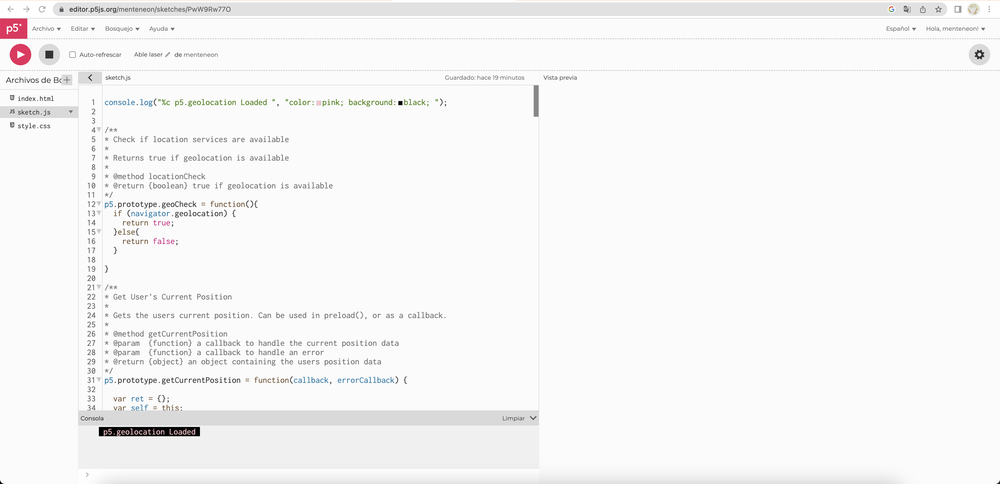
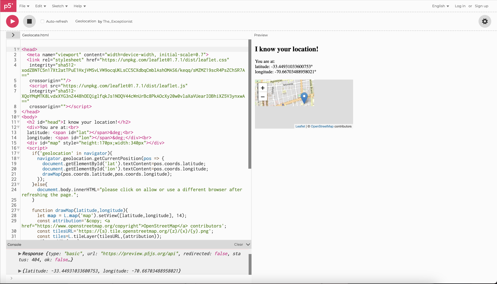
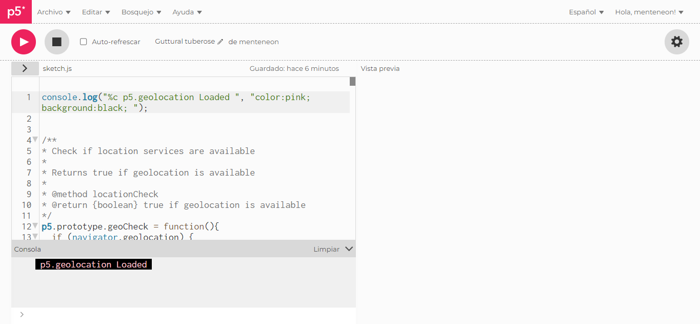

# clase-15

## Investigaciòn sobre p5.geolocation

Es una librería de p5.js tiene técnicas para adquirir, observar, calcular y geocercas ubicaciones, esto desde p5.js
  [Github de p5.geolocation](https://github.com/bmoren/p5.geolocation/tree/master )

## Personas que lo crearon e investigaron

La creación e investigación fue gracias a [Forecast Public Art](https://forecastpublicart.org ) y [Jerome Foundation](https://www.jeromefdn.org) , tambien se le hace un agradecimiento especial a  [Derek Anderson](https://mediaupstream.com/)

Por otro lado se debe correr en el navegador para emular 

## Ultimas actualizaciones 

Al entrar a su Github podemos ver que la actualización más reciente fue hace 6 años y algunas carpetas que no han sido actualizadas en 9 años, esto hace que sea altamente probable que tenga errores. De hecho hay ingresar al README de su Github podemos ver un aviso importante que nos puede alertar de esto 

Su traducción seria: 

IMPORTANTE: tenga en cuenta que Google, Mozilla, Apple y Microsoft están en el proceso de prohibir varias funciones de las páginas web que se sirven desde HTTP en lugar de HTTPS (http seguro)(https://sites.google.com/a/chromium.org/dev/Home/chromium-security/deprecating-powerful-features-on-insecure-origins) Aún puedes hacer esto, pero debe estar sobre "orígenes seguros" (como HTTPS) y esto se puede hacer mediante obtención de un certificado SSL. Visite letsencrypt.org para obtener una opción abierta y gratuita, o comuníquese con su proveedor de alojamiento para ver cómo se puede hacer.

## Cómo utilizar 

Primero hay que entender un par de cosas 

p5.geolocation Funciona con una obtención de coordendas de manera continua, esto refiere a que si el dispositivo se mueve, esta se ira actualizando 

Tiene una precisión de datos de la ubicación, no es un “cercano”, es precisamente donde se encuentra el dispositivo 

Fácil de utilizar !

## ¿Funciona?

# IOS

Al intentar hacerlo funcionar en Chrome no funciona, pero es por la razón que hay que dar un permiso desde la configuración del computador y no tengo acceso a la contraseña de administración del computador 

Hay otra variación de Geolocalizacion la cual da unos mapas al momento de encontrar la latitud y longitud, Esta versión le pertenece a [The_Exceptionist](https://editor.p5js.org/The_Exceptionist/sketches/lNyGx7N6E) 

Por otro lado lo intente desde Safari porque vi que en los permisos del computador se encuentran disponibles el permiso de ubicación desde Safari y no fundionó

# Windows 

Al intentarlo desde un windows y en Chrome, se despliega una pantalla de carga que no carga 

La versión original ya no funcina, se probo en 2 computadores con sistema operativo windows y IOS, también se probó en un celular y tampoco funcionó 

No se como funcionara en Linux :c

## Lineas de código 

* Estas descripciones estan traducidas desde el Github de bmoren
  [link a lineas de codigo](https://github.com/bmoren/p5.geolocation?tab=readme-ov-file#geocheck )

## geoCheck ()

* Comprueba la disponibilidad de la geolocalización. Devuelve verdadero si la geolocalización está disponible o falso si la geolocalización no esta disponible 
	
## getCurrentPosition() usado en  preload()
	
* Se puede utilizar en preload() o con una devolución de llamada. Cuando se usa en precarga, devolverá un objeto que contiene elementos de posición, latitud, longitud, altitud, etc 

## getCurrentPosition() usado con devolución de llamada 

* También se puede utilizar con una devolución de llamada. La devolución de llamada se activa una vez cuando los datos de posición están disponibles

## watchPosition() usado con devolución de llamada 

* Es muy similar a getCurrentPosition(),excepto que activará su devolución de llamada cada vez que la posición del usuario haga un cambio notable. Toma un objeto opcional que contiene opciones de precisión, tiempo de espera y antigüedad

## clearWatch()

* clearWatch() cancela watchPosition()

## intervalCurrentPosition() usado con una devolución de llamada 

* Es un híbrido de wachPosition y getCurrentPosition(). Ejecuta la función getCurrentPosition() en un intervalo de ,milisegundos ,mediante un segundo parámetro opcional, el valor predeterminado es 5000 ms. Esto es útil cuando necesita una detección de ubicación modificada más matizada que la que watchPosition() puede proporcionar

## clearIntervalPos()

* clearIntervalPos() cancela el intervalCurrentPosition()

## calcGeoDistance()

* Calcula la distancia entre dos puntos en las unidades proporcionadas (el valor predeterminado es “mi”, “km” también está disponible )

## geoFenceCircle()

* Es una clase que crea un geoFenceCircle alrededor del punto de latitud/longitud proporcionado con un radio en las unidades proporcionadas(“mi” es el valor predeterminado). Activará una devolución de llamada con un objeto que contiene datos de posición cuando el usuario esté dentro de geoFenceCircle cada vez que se actualice la ubicación. Activará una segunda devolución de llamada cada vez que la posición se actualice y el usuario esté fuera de geoFenceCircle. Toma un objeto que contiene opciones de precisión, tiempo de espera y antigüedad 

* geoFenceCircle se puede borrar usando .clear()

## geoFenceCircle() dentro de una booleana 

* Tiene un parámetro útil para comprobar el estado de Fence. insideFence, cuando se llama a su objeto geoFenceCircle, devolverá verdadero o falso dependiendo de la relación de los usuarios con Fence 

## geoFencePolygon()

* Es una clase que crea un geoFencePolygonalrededor de la matriz proporcionada de objetos que contienen puntos de latitud/longitud. Activará una devolución de llamada con un objeto que contiene datos de posición cuando el usuario esté dentro de geoFencePolygon cada vez que se actualice la ubicación. Activará una segunda devolución de llamada cada vez que la posición se actualice y el usuario esté fuera de geoFencePolygon. Toma un objeto opcional que contiene opciones de precisión, tiempo de espera y antigüedad 

* IMPORTANTE: tener en cuenta sobre el orden de los puntos largos en una matriz de polígonos. El orden de los puntos es muy importante. Deben ingresar en el orden en que los dibujaría. Piénselo como un dibujo de conexión de puntos: debe comenzar con un punto específico y terminar con un punto específico si desea que el polígono sea correcto, pueden ser cuanto como uno quiera 

* geoFencePolygon () se puede borrar usando.clear()

## geoFencePolygin() dentro de una Booleana 

* También tiene un parámetro útil para comprobar el estado de Fence. insideFence cuando se llama a su objeto geoFencePolygon devolverá verdadero o falso dependiendo de la relación  de los usuarios con Fence 
