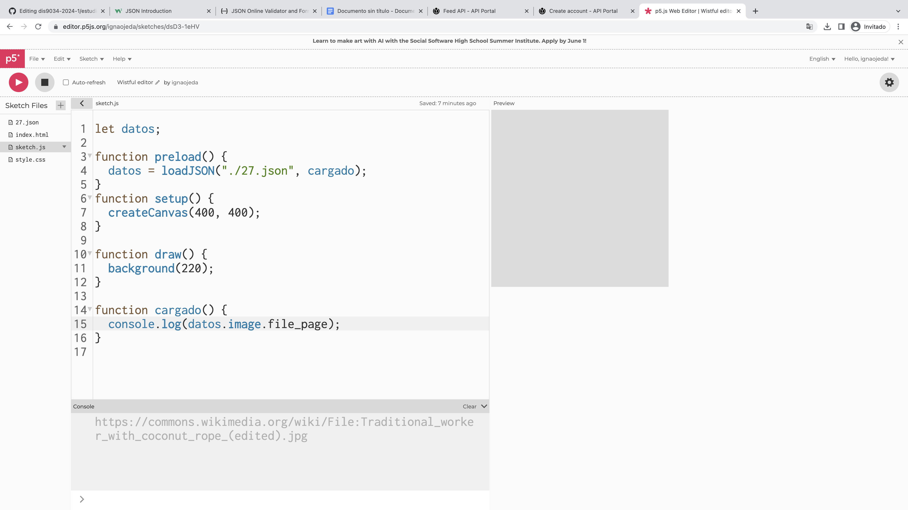
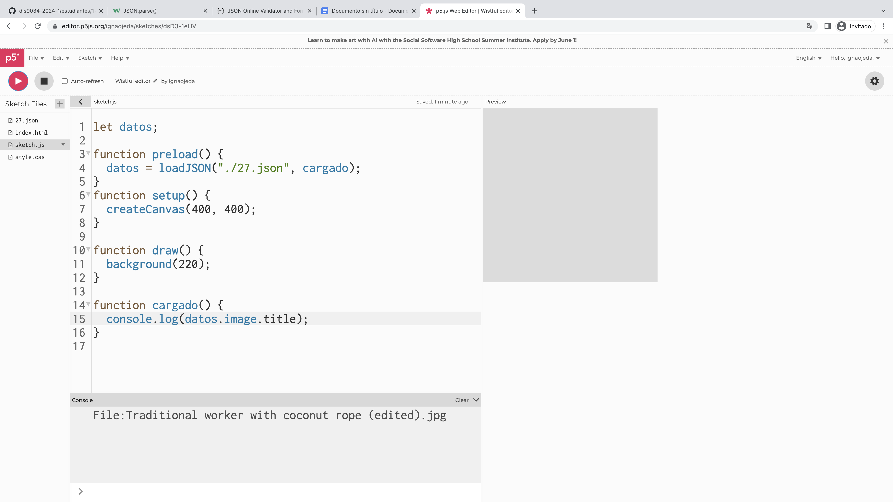
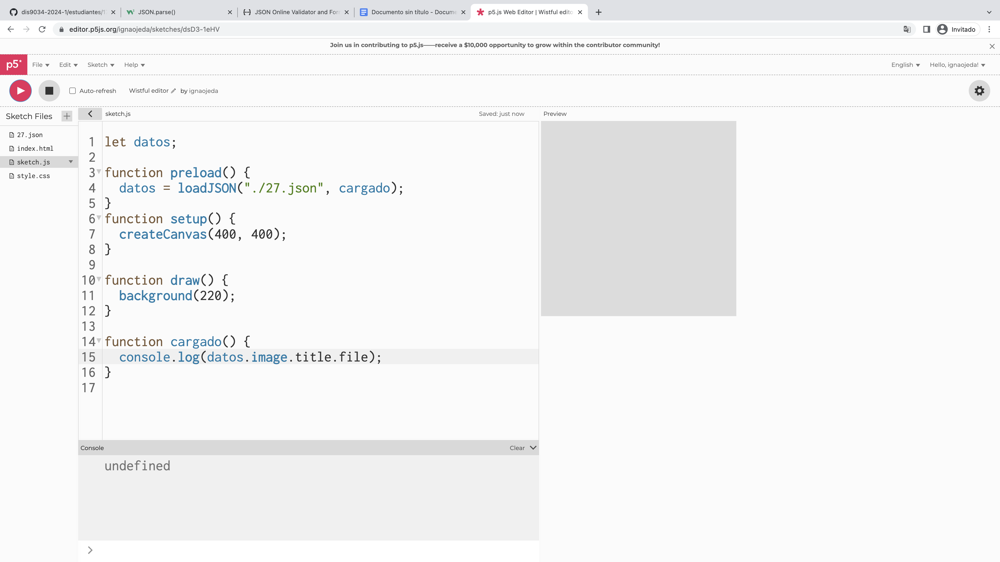
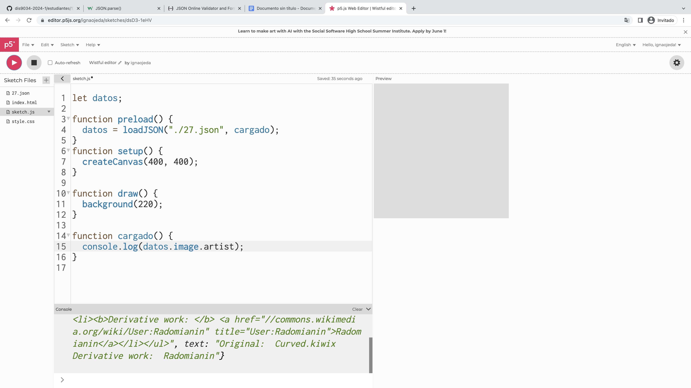
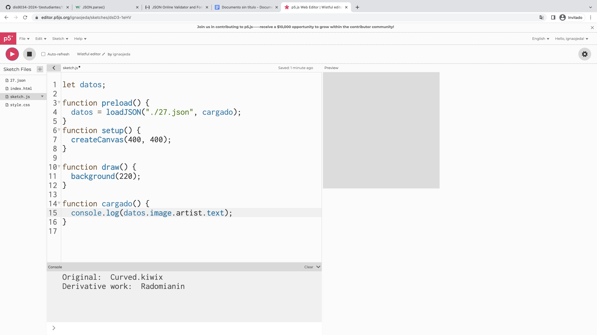

# clase-11
### Apuntes clase 11
   #### Tema de clase: Json

>  https://www.w3schools.com/js/js_json_intro.asp 
W3schools se usa para introducirnos un poco a Json

> https://jsonlint.com/ 
Lo usamos para pegar un código de json encontrado en W3school

Links vistos en clase: 
https://wikibello.cl/ 

Json: es un formato de texto que forma parte del sistema de JavaScript y que se deriva de su sintaxis, pero no tiene como objetivo la creación de programas, sino el acceso.

Debe tener parámetros y valores, si no tiene valor es “null”

{
    "name": "John",
    "age": 30,
    "car": null
}

“John” : No puede estar fuera de comillas porque o sino no lo interpreta.Si lo dejo fuera de las comillas pasaría a ser una ore y no lo es. Es un nombre que se da

“null” : no tiene un valor

> Wiki Api Portal
https://api.wikimedia.org/wiki/Main_Page 
Crear cuenta en el Portal Api de Wikipedia para poder acceder a su uso
(hacerlo más tarde porque no se pudo ahora)

Luego entrar a Feed API 
https://api.wikimedia.org/wiki/Feed_API 

Y acceder al link, ese link descargarlo para luego subirlo a p5js
(link: https://api.wikimedia.org/feed/v1/wikipedia/en/featured/2024/05/27) 

Y luego un código en p5js

 

- Datos útiles: 
->Al poner un punto (.) al programar, estoy pidiendo que abra una carpeta
-> Si está después de una coma (,) y entremedio de un paréntesis entonces es una carpeta. 

Adjunto de imagenes de exploración de Json en p5js

 
 
 
  

