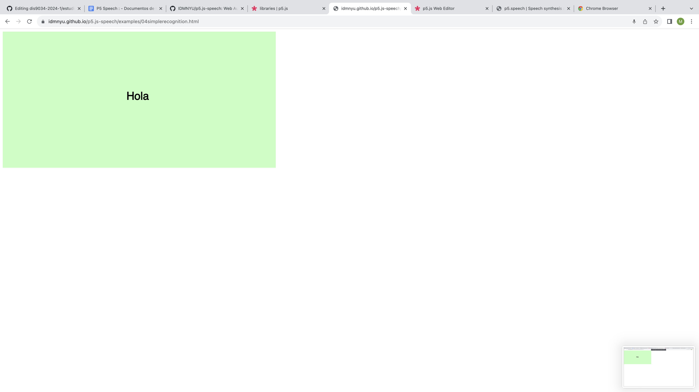

# clase-15

## Investigación sobre Speech p5

  Speech P5 - Creador Luke DuBois (dubois@nyu.edu)
  https://idmnyu.github.io/p5.js-speech/  

p5.speech: Es una extensión de p5 para proporcionar una funcionalidad Web de síntesis y reconocimiento. Consta de dos clases de objetos uno es p5.Speech y el otro p5.SpeechRe. Junto con funciones de acceso para hablar y escuchar texto, cambiar parámetros como diferentes voces de síntesis, modelos de reconocimiento, entre otros. Esta herramienta da acceso simple y claro a las APIs de habla web, permitiendo la creación de bosquejos sencillos que pueden hablar y escuchar. 

El reconocimiento de voz requiere el lanzamiento desde un servidor usando HTTPS (por ejemplo, usando un servidor python en una máquina local).

    HTTPS: Es el protocolo de transferencia de hipertexto seguro, se caracteriza por ser el  principal protocolo utilizado para enviar datos entre un navegador web y un sitio web de forma segura.
  
Web Speech API permite incorporar datos de voz en aplicaciones web. 

La API Web Speech tiene dos partes: 

- SpeechSynthesis (Texto a voz):  Es un componente de texto a voz que permite a los programas leer su contenido de texto a traves del sintetizador de voz predeterminado del dispositivo, por lo general

- SpeechRecognition (Reconocimiento de voz asincrónico): Es una interfaz que permite reconocer el contexto de voz desde una entrada de audio de un dispositivo y responder adecuadamente. Usualmente utiliza el controlador de eventos disponible para detectar cuando es ingresada la voz a través del micrófono del dispositivo, ya sea un smartphone, pc, dispositivo de audio, etc.

- Web speech API Demonstration: Esta web es un ejemplo del funcionamiento de speech. En ella puedes hablar mediante el micrófono de tu dispositivo (ya sean oraciones largas o cortas o también pausadas) y lo que digas será transcrito con este speech, también cuenta con la opción de cambiar el idioma como gustes y seleccionar tu país.  - https://www.google.com/chrome/demos/speech.html 

 

- Ejemplos de speech funcionales

1. En esta web puedes hablar mediante el micrófono de tu dispositivo y lo que digas será transcrito con este speech. Acepta palabras acotadas y va de una palabra en una

interacción: 
 

resultado:
  

[link de web de datos con respecto a speech ](https://developer.mozilla.org/en-US/docs/Web/API/Web_Speech_API) 

[link de web de datos con respecto a speech ](https://idmnyu.github.io/p5.js-speech/ ) 

